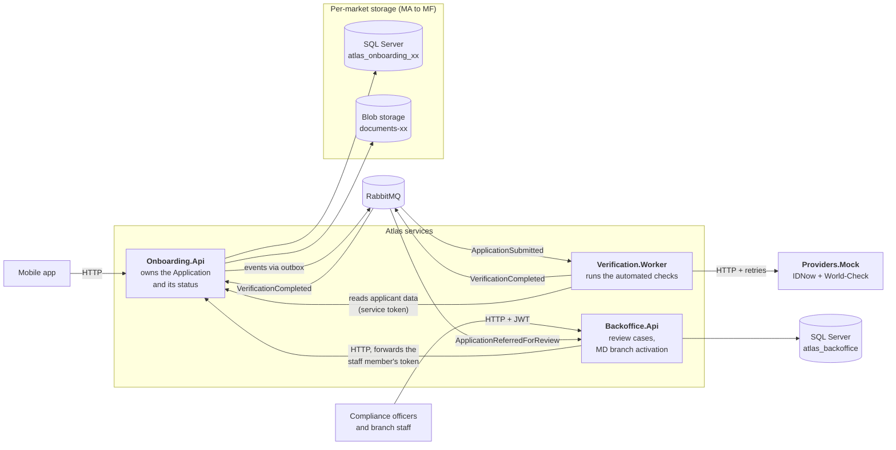
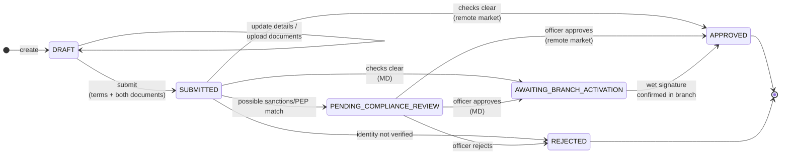

# Atlas: Digital Onboarding Backend

A .NET 8, service-oriented backend for **Atlas**: a customer opens a bank account from their phone
(personal details, a photo of their ID, a selfie, accept the terms) and the system verifies their
identity, screens them against sanctions/PEP lists and decides.

It is built around what the requirements **actually demand**, not only what the ticket asked for:
possible sanctions matches go to a human, market MD needs a branch visit, customer data never leaves its
country, and every access to personal data is attributable to a named person or service.

---

## Contents

1. [Quick start](#1-quick-start)
2. [The problem in one minute](#2-the-problem-in-one-minute)
3. [Architecture](#3-architecture)
4. [Application lifecycle](#4-application-lifecycle)
5. [A full onboarding, end to end](#5-a-full-onboarding-end-to-end)
6. [Code structure](#6-code-structure)
7. [Data and data residency](#7-data-and-data-residency)
8. [API reference](#8-api-reference)
9. [Error handling](#9-error-handling)
10. [Reliability: messaging, outbox, retries](#10-reliability-messaging-outbox-retries)
11. [Security and audit](#11-security-and-audit)
12. [Tests](#12-tests)

---

## 1. Quick start

**Requirements:** Docker, .NET 8 SDK.

From the repository root:

```powershell
./run.ps1        # Windows
./run.sh         # macOS / Linux (same steps)
```

`run.ps1` does three things: starts the infrastructure in Docker and waits until it is healthy, builds the
solution, and starts the four services on the host, each in its own window:

```powershell
# Starts everything: infrastructure in Docker, the four .NET processes on the host (each in its own window).
#   ./run.ps1
$ErrorActionPreference = 'Stop'
Set-Location $PSScriptRoot

Write-Host "1/3 Starting infrastructure (SQL Server, Seq, RabbitMQ, Azurite)..." -ForegroundColor Cyan
docker compose -f platform/docker-compose.yml up -d --wait

Write-Host "2/3 Building the solution..." -ForegroundColor Cyan
dotnet build Atlas.sln
if ($LASTEXITCODE -ne 0) { throw "Build failed." }

Write-Host "3/3 Starting services..." -ForegroundColor Cyan
$services = @(
    'src/Providers/Atlas.Providers.Mock',
    'src/Onboarding/Atlas.Onboarding.Api',
    'src/Verification/Atlas.Verification.Worker',
    'src/Backoffice/Atlas.Backoffice.Api'
)
foreach ($service in $services) {
    Start-Process dotnet -ArgumentList "run --no-build --project $service"
}

Write-Host "Services started. Run the scenarios in requests/atlas.http" -ForegroundColor Green
```

Databases and blob containers are created automatically on first start. Each service exposes Swagger at
`/swagger` and a health check at `/health`; logs of all services are collected in Seq.

**Try it:** open `requests/atlas.http` in Visual Studio, Rider or VS Code (REST Client).
It contains five ready scenarios:

| # | Scenario | Expected result |
|---|---|---|
| 1 | Happy path in MB | `APPROVED` within seconds |
| 2 | Possible sanctions match | `PENDING_COMPLIANCE_REVIEW`, then an officer decides |
| 3 | Market MD | `AWAITING_BRANCH_ACTIVATION`, then `APPROVED` after the branch confirms |
| 4 | Invalid MC identifier | `400` with a field-level error |
| 5 | Provider outage | stays `SUBMITTED`, retries, continues when providers recover |

**Tests:** `dotnet test`

---

## 2. The problem in one minute

The ticket asks for *one POST, one synchronous APPROVED/REJECTED answer, under 3 minutes, fully automated,
one codebase for six markets*. The rest of the material (Compliance position GC-2026-0814, Annex B and six
weeks of team chat) contradicts parts of that. These conflicts drove the design:

| Requirement / conflict | Source (GC = Compliance position GC-2026-0814) | What Atlas does |
|---|---|---|
| A possible sanctions/PEP match must be reviewed by a compliance officer (up to 48h); never automated, never auto-rejected | GC point 3 | New status `PENDING_COMPLIANCE_REVIEW`, a review queue in Backoffice, and an asynchronous API (`202 Accepted`) |
| MD requires a branch visit and wet signature before activation; the exemption is not granted | Annex B, note 1 | Status `AWAITING_BRANCH_ACTIVATION`, driven by market configuration, not a code fork |
| Customer data must not leave the country of residence | GC point 1 | One database and one blob container per market; events carry ids only |
| Every access to personal data must be attributable; no shared credentials | GC point 2 | Audit log per market; staff tokens are forwarded end to end |
| The national id differs per market; MF residents may have none (passport instead); it must not be a key | Annex B, chat | Per-market identifier validation from `markets.json`; internal ids as keys |
| Save and resume after a lost connection; base64 images of several MB in JSON | Chat | The flow is split into steps: create, upload, submit, check status; images are uploaded as raw bodies |
| Retain 10 years vs. erase on request | GC points 4 and 5 | Documented as an open question; erasure not implemented |

---

## 3. Architecture

Three services and one mock, split by **who uses them** and by **what can be slow or fail**.



| Service | Why it is a separate service |
|---|---|
| **Onboarding.Api** | The only owner of an application's status, so the rules cannot drift between services. Serves mobile and internal callers. |
| **Verification.Worker** | Provider calls are slow and can fail. In a background worker an outage means waiting and retrying, not a failed request for the customer. Scales independently. |
| **Backoffice.Api** | Different users (staff), different authentication, market-scoped permissions, and every read is audited. Keeps staff endpoints out of the public API. |
| **Providers.Mock** | No real provider credentials are available. A real HTTP service means the retry and resilience code is actually exercised. Not part of the product. |

**Rejected alternative:** one service per step (documents, screening, accounts, etc.). It adds boundaries and
distributed-transaction problems without any benefit for a single flow.

---

## 4. Application lifecycle

All status changes happen in one class, `Application` (the domain aggregate). Nothing else can set the status.



Rules enforced by the domain (and covered by tests):

- A possible match is **never** rejected or approved automatically.
- MD **never** reaches `APPROVED` without the branch confirmation.
- Nothing can be changed after submitting.
- A compliance decision always has a named officer and a reason.
- A provider outage never rejects anyone: the application stays `SUBMITTED` until the checks can run.

---

## 5. A full onboarding, end to end

Arta, market MB. Steps 1 to 5 are what she does in the app; step 6 happens in the background.

| # | Arta / system | Endpoint or event | Handled by | Status after |
|---|---|---|---|---|
| 1 | Chooses her country | `GET /markets/MB/requirements` | `MarketService` | |
| 2 | Enters personal details | `POST /applications` | `ApplicantService.CreateAsync`, `Application.Start` | `DRAFT` |
| 3 | Photographs her ID | `PUT /applications/{id}/documents/IDENTITY_DOCUMENT` | `ApplicantService.UploadDocumentAsync` | `DRAFT` |
| | Loses connection, reopens the app | `GET /applications/{id}` (returns `nextSteps`) | `ApplicantService.GetAsync` | `DRAFT` |
| 4 | Takes a selfie | `PUT /applications/{id}/documents/SELFIE` | `ApplicantService.UploadDocumentAsync` | `DRAFT` |
| 5 | Accepts the terms | `POST /applications/{id}/submit` (202) | `ApplicantService.SubmitAsync`, `Application.Submit` | `SUBMITTED` |
| 6a | Outbox publishes the event | `ApplicationSubmitted` | `OutboxPublisher` | |
| 6b | Worker runs the checks | IDNow, then World-Check | `VerificationService` | |
| 6c | Result is applied | `VerificationCompleted` | `VerificationResultService`, `Application.RecordVerification` | `APPROVED` |
| 7 | Sees the result | `GET /applications/{id}` | `ApplicantService.GetAsync` | `APPROVED` |

**Possible sanctions match:** at 6c the status becomes `PENDING_COMPLIANCE_REVIEW` and Onboarding publishes
`ApplicationReferredForReview`. Backoffice opens a review case (due in 48h). The officer lists her market's
cases (`GET /review-cases`), opens one (`GET /review-cases/{id}`; Backoffice reads the application from
Onboarding with the officer's own token, so the read is audited against her), and decides
(`POST /review-cases/{id}/decision`), which Onboarding applies to the application.

**Market MD:** at 6c the status becomes `AWAITING_BRANCH_ACTIVATION`; after the wet signature, branch staff call
`POST /branch-activations` and the application becomes `APPROVED`.

---

## 6. Code structure

### Layers

The Onboarding service is split into four projects. Dependencies point inwards: the domain knows nothing
about databases or HTTP.


| Layer | Does | Does not |
|---|---|---|
| **Controller** | Reads the HTTP request, calls **one** service method, returns `FromResult(...)` | Validate, query, decide |
| **Service (UseCases)** | Validates input, resolves the market, checks access, calls the domain, writes the audit entry, saves | Know about HTTP, EF Core or Azure |
| **Domain** | Decides: every status change and business rule | Know about storage or transport |
| **Infrastructure** | Implements storage, blob, outbox behind the UseCases interfaces | Contain business rules |


### Solution layout

```
atlas-onboarding/
|-- platform/docker-compose.yml         SQL Server, Seq, RabbitMQ, Azurite
|-- requests/atlas.http                 ready-to-run scenarios
|-- run.ps1 / run.sh                    one command to start everything
|-- src/
|   |-- BuildingBlocks/
|   |   |-- Atlas.Common                Result<T> and Error
|   |   |-- Atlas.Markets               markets.json (Annex B) + identifier validation
|   |   |-- Atlas.Contracts             integration events (ids only)
|   |   `-- Atlas.ServiceDefaults       logging, errors, controllers, JWT, RabbitMQ
|   |-- Onboarding/
|   |   |-- Atlas.Onboarding.Domain          Application aggregate, value objects, domain events
|   |   |-- Atlas.Onboarding.UseCases        Services/ Dtos/ Validation/ Mapping/ Abstractions/
|   |   |-- Atlas.Onboarding.Infrastructure  Persistence/ Storage/ Outbox/ Auditing/
|   |   `-- Atlas.Onboarding.Api             Controllers/ Messaging/ Security/ ErrorHandling/
|   |-- Verification/Atlas.Verification.Worker   Services/ Clients/ Messaging/
|   |-- Backoffice/Atlas.Backoffice.Api          Controllers/ UseCases/ Dtos/ Domain/ Infrastructure/
|   `-- Providers/Atlas.Providers.Mock           Controllers/ Services/ Filters/ Models/
`-- tests/
    |-- Atlas.Onboarding.Domain.Tests
    |-- Atlas.Markets.Tests
    `-- Atlas.Backoffice.Tests
```

Backoffice, the worker and the mock are small, so they use the same separation **as folders** inside one
project instead of separate projects.

---

## 7. Data and data residency

Each market has its own database and its own blob container. The application id carries the market
(`MB-3f2a...`), so every service routes to the right storage without a central lookup table.

| Store | Contents |
|---|---|
| `atlas_onboarding_{market}` | `Applications`, `ApplicationDocuments`, `AuditEntries`, `OutboxMessages` |
| `documents-{market}` (blob) | ID document and selfie images |
| `atlas_backoffice` | `ReviewCases`: ids, market, due date, decision and officer only, **no personal data** |

Locally all markets share one SQL Server and one Azurite. In production each entry in `MarketStorage`
would point to infrastructure inside that country; the code does not change.

---

## 8. API reference

### Onboarding.Api: mobile

The applicant is identified by the `X-Applicant-Token` header returned at creation (only its hash is stored).

| Method | Route | Purpose | Success |
|---|---|---|---|
| GET | `/markets` | All markets and their rules | 200 |
| GET | `/markets/{market}/requirements` | Accepted identifiers, activation mode, documents, terms version | 200 |
| POST | `/applications` | Create a draft with personal details | 201 + token |
| GET | `/applications/{id}` | Status and `nextSteps` (resume) | 200 |
| PUT | `/applications/{id}/details` | Correct details (draft only) | 200 |
| PUT | `/applications/{id}/documents/{IDENTITY_DOCUMENT\|SELFIE}` | Upload image as raw body, `image/jpeg`/`image/png`, max 10 MB | 200 |
| POST | `/applications/{id}/submit` | Accept terms and submit (idempotent) | 202 |

### Onboarding.Api: internal (JWT)

| Method | Route | Role |
|---|---|---|
| GET | `/internal/applications/{id}` | ComplianceOfficer, BranchStaff, VerificationService |
| GET | `/internal/applications/{id}/documents/{type}` | ComplianceOfficer |
| POST | `/internal/applications/{id}/compliance-decision` | ComplianceOfficer |
| POST | `/internal/applications/{id}/branch-activation` | BranchStaff |

### Backoffice.Api: staff (JWT with `role` and `market`)

| Method | Route | Purpose |
|---|---|---|
| POST | `/dev/token` | **Development only**: log in as a named officer or branch employee of one market |
| GET | `/review-cases?status=OPEN` | The officer's queue for their market, most urgent first |
| GET | `/review-cases/{applicationId}` | Case + live application data (audited) |
| GET | `/review-cases/{applicationId}/documents/{type}` | View a document (audited) |
| POST | `/review-cases/{applicationId}/decision` | `APPROVE` / `REJECT` with a mandatory reason |
| POST | `/branch-activations` | MD: confirm the wet signature |

---

## 9. Error handling

Two kinds of failure are handled differently, on purpose:

| Kind | Example | Mechanism | HTTP |
|---|---|---|---|
| **Expected** (bad input, not found, not allowed) | invalid identifier, wrong token, other market | Services return `Result<T>` with an `Error` | mapped by `ApiControllerBase` |
| **Broken business rule** (invariant) | submit without documents, action in the wrong status | The domain throws `DomainException` | mapped by `DomainExceptionHandler` |
| **Unexpected** | database down | normal exception | 500 ProblemDetails, logged |

| Error | Status |
|---|---|
| Validation | 400 (with field errors) |
| Forbidden (wrong market / role) | 403 |
| NotFound (also for a wrong applicant token, so existence is not revealed) | 404 |
| Conflict / invalid status transition / concurrent update | 409 |
| Unsupported image type / too large / no length | 415 / 413 / 411 |
| Business rule violated | 422 |

Every error body is an RFC 9457 `ProblemDetails`, with a machine-readable `code` where relevant.

---

## 10. Reliability: messaging, outbox, retries

- **Transactional outbox**: the status change and its event are saved together. There is no
  "status changed but the event was lost".
- **At-least-once delivery, idempotent consumers**: a duplicate message is recognised (the application is no
  longer `SUBMITTED`, the review case already exists) and ignored.
- **Retries in two layers**: HTTP calls to providers use a resilience pipeline (timeouts, 3 retries with
  backoff, circuit breaker). Longer outages are covered by message retries (10 attempts, up to 2 minutes apart).
- **Optimistic concurrency**: `rowversion` on `Applications`; with several replicas, only one writer wins
  and the other gets a 409 or a retried message.
- **Idempotent API calls**: repeating `submit`, a compliance decision or a branch activation returns the
  current state instead of failing.

---

## 11. Security and audit

- **Applicants** receive a random token at creation; only its SHA-256 hash is stored, compared in constant time.
- **Staff** authenticate with a JWT (`sub`, `role`, `market`). Officers only see and decide cases of their
  own market. Locally, `POST /dev/token` stands in for the bank's identity provider.
- **Backoffice forwards the officer's own token** to Onboarding, so the audit log records the person, not
  a shared "Backoffice" credential (GC point 2).
- **The worker has its own service identity** (`svc-verification-worker`), which appears in the audit log.
- **Audit log**: every create, read, update and decision on an application records actor type, actor id,
  action, purpose and time, in the market's own database.
- **No personal data** in events or logs, only application ids.

---

## 12. Tests

```
dotnet test
```

| Project | Covers |
|---|---|
| `Atlas.Onboarding.Domain.Tests` | The status rules: possible match never auto-rejected, MD waits for the branch, no changes after submit, decisions need an officer and a reason, application id format |
| `Atlas.Markets.Tests` | The real `markets.json`: six markets, only MD in-branch, valid/invalid identifiers per market, passport only in MF |
| `Atlas.Backoffice.Tests` | Review case due time (48h), overdue, a decision cannot be changed |
